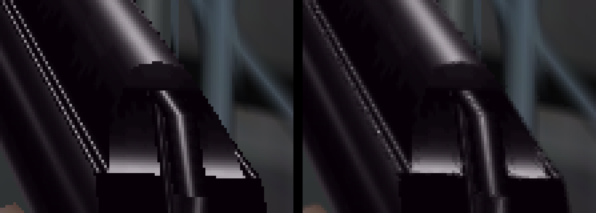
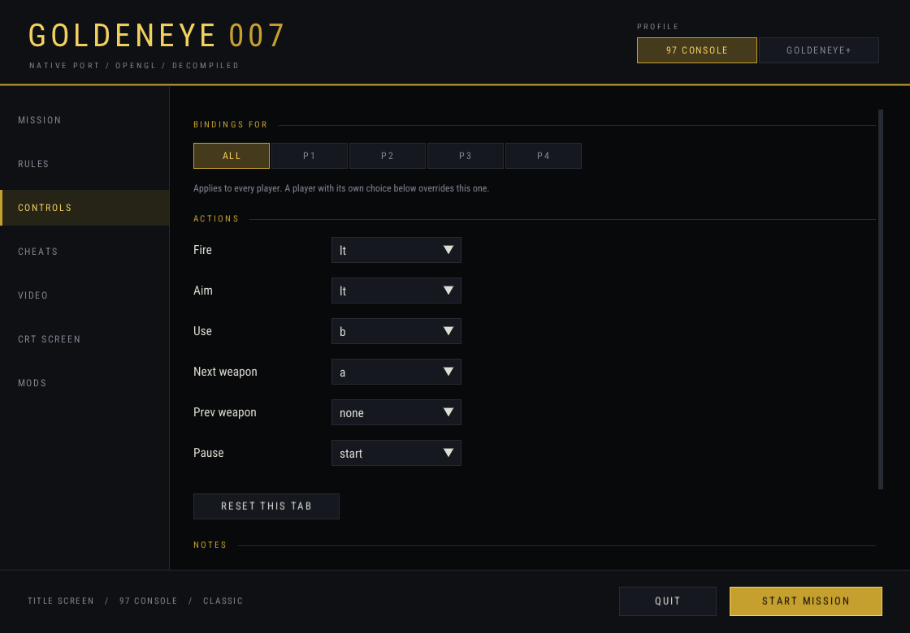
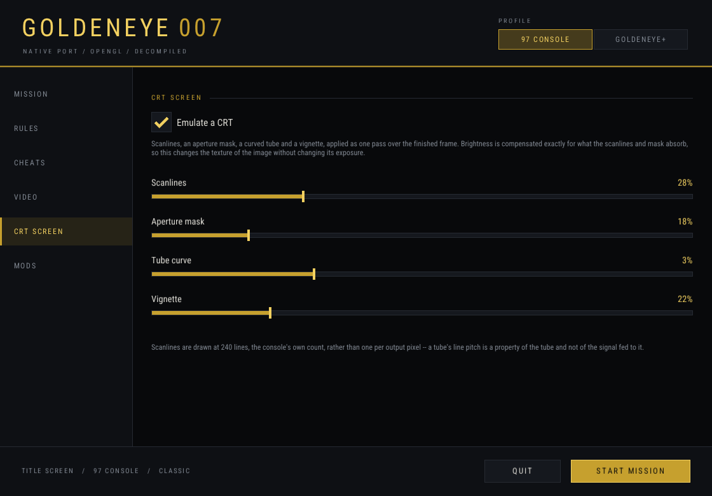
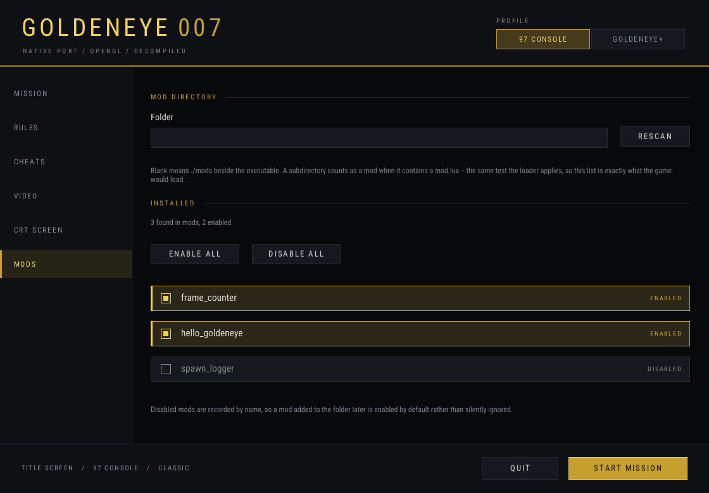

# Goldeneye-Native

**GoldenEye 007, compiled as a native application for macOS, Linux and Windows.** Mouse and
keyboard. Real widescreen. Hundreds of frames a second with the game still running at the original 1997 animation speed
Rare tuned it to. Online Multiplayer or Co Op, AI Bots, Lua mod pack scripting, horde mode, a free flying photo camera, HD upgrades, and more!


This is not an emulator. It is the game's own source code, from the
[`n64decomp/007`](https://github.com/n64decomp/007) decompilation, built into a real binary for
your machine. There is no N64 being pretended at underneath, which is why the things emulators
can only work around, this one just fixes.

You supply your own legally dumped cartridge. No game data ships here, and none ever will.

## Install it

### On a Mac

**1.** Get your own GoldenEye 007 ROM and leave it on your **Desktop**. Do not rename it.

**2.** On [the project page](https://github.com/SegfaultEvan/goldeneye-native), click the green
**Code** button, then **Download ZIP**. Double-click the downloaded file to unzip it.

**3.** Open the folder that appears and **double-click `Install on Mac`**.

A window opens and does the rest. It takes 10 to 40 minutes the first time, almost all of it
reading your cartridge, and you can leave it running. If macOS says the file is from an
unidentified developer, right-click it and choose **Open** instead, then **Open** again.

**4.** When it finishes, **double-click `Play GoldenEye`** in the same folder.

That is it. Drag `Play GoldenEye` to your Dock if you want it there permanently.

### On Windows

**1.** Install **Git for Windows** from [git-scm.com](https://git-scm.com/download/win). Click
Next through the installer; every default is correct.

**2.** Install **Python** from [python.org](https://www.python.org/downloads/windows/). On the
first screen of the installer, **tick "Add python.exe to PATH"** before clicking Install. This
one box matters; nothing works without it.

**3.** Get your own GoldenEye 007 ROM and leave it on your **Desktop**.

**4.** Download **`setup_wizard.exe`** from
[Releases](https://github.com/SegfaultEvan/goldeneye-native/releases) and double-click it.

The wizard asks where to install and which file is your ROM, then does everything else itself
and shows you what it is doing. It takes 10 to 40 minutes the first time.

### On Linux

Install `git` and `python3` from your package manager, then:

```bash
bash tools/install.sh
```

It prints the exact package command for your distribution if anything is missing.

### If something goes wrong

Nothing here can break your computer or your ROM, and nothing is ever uploaded anywhere.

- **It stopped partway.** Run it again. It picks up where it left off rather than starting over.
- **It cannot find your ROM.** Put the file on your Desktop with a `.z64`, `.n64` or `.v64`
  ending. Any of the three common formats works and it converts what it needs to.
- **It says Git or Python is missing.** Go back to step 1 or 2. On Windows this is almost always
  the "Add python.exe to PATH" box.
- **Anything else.** Open an issue with the last twenty lines it printed. Never attach your ROM
  or a save file.

### What you need, in full

| | |
|---|---|
| Your own GoldenEye 007 cartridge dump | Nothing playable ships here, ever |
| About 4 GB of free disk | The source, the extracted assets and the build |
| 10 to 40 minutes, once | After that, starting the game is instant |

## Screenshots

| | |
|---|---|
|  |  |
|  |  |



Captured from this port, not from an emulator, on the default settings unless the caption says
otherwise.

## Which platforms work

| Platform | Renderer | State |
|---|---|---|
| **macOS** (Apple silicon and Intel) | OpenGL or native Metal | Builds and plays. Primary target. |
| **Linux** (x86-64 and arm64) | OpenGL | Builds Verified on Debian 12 aarch64. |
| **Windows** (x86-64) | OpenGL | Builds native mingw-w64. Self-test 16 of 16. |
| **tvOS** (Apple TV) | GL ES or Metal | Builds, signs and deploys to real hardware. |
| **iOS** | Metal | Bring-up. Builds; deploying needs a paired device. |

Same source tree everywhere. One build script each.

## The frame-rate fix, which is the reason the rest is possible

GoldenEye counts time in whole video fields. On every emulator ever made, running it faster runs
the *game* faster: guards firing at double speed, ammunition draining, the AI thinking quicker
than it was tuned to. That is baked into the game rather than the hardware, so nobody could fix
it from outside.

It is fixed here. The world keeps its own time while the renderer runs as fast as your machine
allows.

Measured on the Dam, 1280x960, Apple M1, three runs each:

| Profile | Game speed (fields/sec, 60 is correct) | Rendered frames per second |
|---|---|---|
| 97 Console, as shipped | 59.2 | 59 |
| 97 Console, uncapped | 61.0 | 486 |
| GoldenEye+ | 61.0 | 182 |
| GoldenEye+ with an HD texture pack | 60.8 | 177 |

486 frames a second with the game itself ticking at the 60 it should. Bond moves at the speed he
moved in 1997 and the picture is as smooth as your monitor can show.

[`docs/FRAME_TIMING.md`](docs/FRAME_TIMING.md) has the whole account.

## What works

| Feature | State | Detail |
|---|---|---|
| **Fixed frame tick** | **Done** | Uncapped rendering with the world still ticking at 60. Nothing else here is possible without it. |
| **Mouse and keyboard** | **Done** | The default. Real mouse look, tuned and unit-tested. [`MOUSE.md`](docs/MOUSE.md) |
| **Controller support** | **Done** | Xbox, PlayStation and MFi pads through SDL2, plugged in and detected. All 8 retail control styles. |
| **Widescreen and ultrawide** | **Done** | The renderer takes its aspect from the actual framebuffer, so any window shape works, 16:9 through ultrawide. HUD and gun sight corrected. |
| **27 loadable stages** | **Done** | Every mission the cartridge shipped, plus the multiplayer-only arenas. Counted by [`stage_census.sh`](tools/stage_census.sh). |
| **Split screen** | **Done** | Two, three and four players, all 64 characters, the radar, every scenario. |
| **HD texture packs** | **Done** | PNGs named by texture hash, dropped in a folder. Verified end to end at 4x upscale. |
| **Lua scripting and mod packs** | **Done** | Scripted mods loaded from a folder, with a real API. [`MODDING.md`](docs/MODDING.md) |
| **Built-in CRT filter** | **Done** | Scanlines, shadow mask, curvature and vignette, each adjustable. No shader pack to install. |
| **Cheats, built in** | **Done** | The game's own cheat system exposed by name, without the unlock grind. Not GameShark codes. [`CHEATS.md`](docs/CHEATS.md) |
| **Game mode presets** | **Done** | `classic`, `hardcore`, `survival`, `chaos` and `horde` rulesets, freely combinable. |
| **Graphics profiles** | **Done** | One switch: `97 Console` for the faithful look, `GoldenEye+` for everything this port adds. |
| **Toggle aim** | **Done** | Press once to raise the sight instead of holding the button. The game's own option, exposed as `aim_toggle`. |
| **Coloured reticle** | **Done** | Any RRGGBB, and a smaller modern sight size. How cleanly a colour takes depends on the baked asset. |
| **Post-processing** | **Done** | FXAA, MSAA to 4x, supersampling, anisotropic filtering, mipmaps, parallax mapping. |
| **Two renderers** | **Done** | OpenGL everywhere, plus a native Metal backend on Apple platforms. Not MoltenVK. |
| **Launcher** | **Done** | A window for level, ruleset, cheats and video settings. No config file needed. |
| **Real-font text** | **Done** | Optional crisp menu text through a TrueType atlas instead of stretched 24-pixel glyphs. Off by default. |
| **Saves** | **Done** | Persistent, in your platform's normal application-data directory. |
| **Around 250 settings** | **Done** | Every development gate settable by name, from the config file or the command line. |
| **Free camera** | **Beta** | Photo mode. `F8` unpins the camera from Bond and hands you the room: fly it on `W` `A` `S` `D`, look with the arrows, rise and drop on `R` and `F`, hold shift or ctrl to change pace. The camera is Rare's own -- a six-degree fly camera that shipped inside the cartridge and was never reachable from a controller. Visibility still roots at Bond, so leaving his room culls the world behind you. |
| **Bots** | **Beta** | Fightable opponents with skill tiers that vary five dials, not one. [`BOTS.md`](docs/BOTS.md) |
| **Horde mode** | **Beta** | Waves of enemies. Never in the original. [`COOP.md`](docs/COOP.md) |
| **Co-op** | **Beta** | Two to four players through a solo mission's own geometry, objectives and cutscenes. The mission is authored around one Bond, so extra players are present rather than accounted for. |
| **LAN multiplayer** | **Beta** | Connects, exchanges input, completes a real session over UDP. It also desyncs. Read the limitation before planning an evening around it. [`NETPLAY.md`](docs/NETPLAY.md) |

## Which game exactly

| | |
|---|---|
| Game | GoldenEye 007 |
| Revision | US retail, SHA-1 `abe01e4aeb033b6c0836819f549c791b26cfde83` |
| Status | The only revision built and tested |

The installer converts a byte-swapped dump and then checks the result against that SHA-1, so a
wrong or damaged file is refused with an explanation rather than producing a broken build twenty
minutes later.

## GoldenEye+ versus 97 Console

Two profiles. Set `preset = plus` or `preset = faithful` in the config file, or pick one in the
launcher.

**97 Console** is the default and stays the default. The N64 look is the product, and correctness
here is checked by comparing against captures from real hardware, so anything that alters the
image has to be something you asked for.

**GoldenEye+** is one switch for everything this port has added and verified:

| Turns on | Value |
|---|---|
| Supersampling | 2x |
| MSAA | 4x |
| Anisotropic filtering | 8x |
| Mipmaps | on |
| HD textures | on |
| Parallax mapping | on |
| FXAA | on |
| Crosshair scale | 0.6, a smaller modern reticle |
| Frame rate | uncapped, on the real clock |

Anything the profile wanted but found already set in your config is named on stdout at startup
rather than passed over quietly, because a preset that silently declined to uncap the frame rate
looks exactly like a preset that did not work.

## The launcher

`--launcher` opens a window for choosing a level, a ruleset, cheats and video settings before the
game starts, so none of this needs a config file or a terminal.

| | |
|---|---|
|  |  |



It is a user interface over the settings that already existed rather than new capability: every
control resolves to a gate that worked from a shell, and each one opens showing the value the
config layer just resolved, so it reflects your config file rather than competing with it.

It restarts the game to apply, deliberately. Most of the port's settings are read once on first
use, so changing one after the game has started does nothing, silently. The launcher sets the
environment and re-executes, so the game begins in a process where nothing has been read yet.

## First launch

```bash
./getv/build-mac/goldeneye            # macOS
./getv/build-linux/goldeneye          # Linux
getv\build-windows\goldeneye.exe      # Windows
```

Add `--launcher` for the settings window. On Linux the installer can also register a desktop
entry, so the game shows up in your applications menu; it asks first, and removing that one file
uninstalls it.

Settings live in a plain text file that the game writes on first run, and it prints the path it used.
[`docs/CONFIGURATION.md`](docs/CONFIGURATION.md) lists every key.

## If it does not work

**The installer stopped.** It names the step and the reason. Re-running is safe and resumes.
The commonest causes are a missing prerequisite from step 1 and a ROM it could not find.

**It says it cannot find your ROM.** Put it on the Desktop with a `.z64`, `.n64` or `.v64`
extension, or pass the path directly: `bash tools/install.sh --rom /path/to/rom.z64`.

**It built but will not start.** Run the self-test and report what it says:

```bash
bash getv/port/tests/run_tests.sh
```

**Reporting a problem.** Include your platform, the four build counts the installer printed, and
the last twenty lines before it stopped. Never attach a ROM, a save, or anything extracted from
one; issues containing game data get closed without being read.

## Controls

| Control | Keyboard | Mouse |
|---|---|---|
| Move | `W` `A` `S` `D` | |
| Look | Arrow keys | Mouse |
| Fire | `Space` or `Left Ctrl` | Left button |
| Aim | `Q` | Right button |
| Use, open, plant | `E` or `F` | |
| Next weapon | `R` | |
| Start and menu confirm | `Tab`, `Return` | |
| Back | `Backspace` | |
| Lean left and right | `Z` `X` | |

The game prints this list at startup, so it is never a guess. `GETV_KEYBOARD=0` turns the
keyboard binding off if you would rather use only a pad.

`F8` hands the camera to you. It flies on the same `W` `A` `S` `D`, looks with the arrows, rises
and drops on `R` and `F`, and changes pace while shift or ctrl is held. Those keys keep their
normal jobs at the same time -- `R` still cycles weapons underneath you -- because the game does
not pause while you fly. `F8` again gives the camera back to Bond.

All eight retail control styles are implemented, including the two-controller layouts, and a
gamepad is picked up automatically when one is plugged in. Mouse sensitivity and inversion are
adjustable; the arithmetic behind mouse look is written up and unit-tested in
[`docs/MOUSE.md`](docs/MOUSE.md).

## Resolution, performance and how it looks

Resolution, supersampling, MSAA, anisotropic filtering, FXAA and the CRT filter are all in the
launcher and in the config file. On an M1 the game runs at several hundred frames a second at
1280x960 with the GoldenEye+ profile on, so most of these cost nothing you will notice.

HD texture packs go in a folder and are matched by texture hash. None ships here, for the same
reason no ROM does. The machinery is verified: a 128x32 N64 texture was replaced by a 512x128
pack image at 4x and rendered.

[`docs/PERFORMANCE.md`](docs/PERFORMANCE.md) has the measurements.

## Reproducible, and free of game data

No ROM, no extracted asset and no decompiled game source is stored in this repository. What is
stored is the port layer, the build scripts, and patches that are applied to a decompilation you
clone yourself. `tools/check_patches.sh` proves every patch still applies to a clean checkout,
and the installer verifies each step actually produced what it claimed rather than trusting an
exit code.

## Known limitations

Written plainly, because a README that oversells is worse than one that undersells.

- **Network play desyncs.** The transport, discovery, launcher page and game-loop tick are all
  wired, and two machines do complete a real session over UDP. But they drift out of sync with
  nobody touching a controller: five trials of two processes with no input, zero agreed. Two
  causes have been found and fixed and neither was sufficient. Treat LAN play as something to
  experiment with, not to plan an evening around. [`docs/NETPLAY.md`](docs/NETPLAY.md)
- **Linux is unplayed.** It builds and renders; nobody has played a mission through on it.
- **Windows is unplayed too.** It builds, boots, passes the self-test 16 of 16, and the settings
  have since been measured there rather than assumed: field of view, crosshair scale, the CRT
  filter and HD texture packs all take effect, and netplay opens a session. What nobody has done
  on Windows is sit down and play a mission through.
- **The MI5 crest is missing** on the multiplayer character select. The same asset renders
  correctly on the file-select screen, so the decode path is sound and the fault is elsewhere.
- **Select File draws a flat black background** where the original has a faint watermark.
- **Some multiplayer edge cases** are unenforced on the headless path, including score caps.
- **tvOS and iOS are bring-up**, not products. They build and deploy; they are not finished.

[`docs/ROADMAP.md`](docs/ROADMAP.md) carries the full list and what is planned.

## Frequently asked questions

**Is this an emulator?** No. An emulator interprets N64 machine code and pretends to be the
hardware. This is the game's own C, compiled for your processor, drawing through your GPU. That
is why the frame-rate problem is fixable here and not there.

**Do I need a ROM?** Yes, your own. Nothing playable ships here. The installer reads your copy,
extracts the assets it needs on your machine, and never uploads anything.

**Is it legal?** The decompilation is clean-room work by the
[`n64decomp/007`](https://github.com/n64decomp/007) project and contains no Nintendo or Rare
copyrighted data. This repository adds a port layer on top of it. You supply your own cartridge
dump. GoldenEye 007 and its trademarks belong to their owners; this project is unaffiliated with
Nintendo, Rare, MGM or EON.

**Will it run on my machine?** If it has a GPU from the last decade and runs macOS, Linux or
Windows, almost certainly. It is not demanding; the original targeted 1996 hardware.

**Can I play with a controller?** Yes, and with mouse and keyboard, and with all eight of the
game's original control styles.

**Does multiplayer work?** Split screen, yes, fully. Over a network, not reliably yet, and the
Known limitations section says exactly how far it gets.

**Why is it called GoldenEye+?** It is the name for the profile that turns on everything this
port adds. The faithful profile is still the default.

**Can I use HD texture packs?** Yes. Drop PNGs named by texture hash into the pack folder. None
is included.

**Where do saves go?** Your platform's usual application-data directory. The exact path is
printed at startup.

**Why were my explosions rainbow-coloured?** They were decoding RGBA16 texels in the wrong byte
order, which turned orange into magenta and read on screen as confetti. That is fixed and on by
default now. It was never the paintball cheat, which is what it gets mistaken for.
[`docs/COLOUR_BUGS.md`](docs/COLOUR_BUGS.md) has the measurements.

**Can four of us play on one screen?** Yes. Two, three and four player split screen, every
scenario, all 64 characters and the radar.

**Does it need an internet connection?** No. Nothing here phones home, and the installer only
reaches the network to clone the decompilation and fetch build dependencies.

**Can I change the field of view?** Yes, live, without restarting.

**Is there a debug menu?** Yes, and the stage census, render-reference and input-trace tools the
project uses on itself are all in `tools/`.

## Project map

| Path | What is in it |
|---|---|
| [`tools/install.sh`](tools/install.sh) | The one-command installer for macOS and Linux. |
| [`tools/install.ps1`](tools/install.ps1) | The Windows installer. |
| [`getv/port/`](getv/port/) | The port layer: renderer, input, audio, saves, netplay. |
| [`getv/port/fast3d/`](getv/port/fast3d/) | The display-list renderer, OpenGL and Metal backends. |
| [`getv/patches/`](getv/patches/) | Every change made to the decompilation, as numbered patches. |
| [`getv/port/tests/`](getv/port/tests/) | The self-test suite. |
| [`docs/SETUP.md`](docs/SETUP.md) | Doing the install by hand, and what each step is for. |
| [`docs/CONFIGURATION.md`](docs/CONFIGURATION.md) | Every setting, with what it does. |
| [`docs/FRAME_TIMING.md`](docs/FRAME_TIMING.md) | The frame-rate fix, in full. |
| [`docs/MODDING.md`](docs/MODDING.md) | Lua mods and HD texture packs. |
| [`docs/BOTS.md`](docs/BOTS.md) | The bot system. |
| [`docs/NETPLAY.md`](docs/NETPLAY.md) | Network play, including what is broken and why. |
| [`docs/PERFORMANCE.md`](docs/PERFORMANCE.md) | Measurements. |
| [`docs/ROADMAP.md`](docs/ROADMAP.md) | State, known issues, planned work. |
| [`docs/LICENSING.md`](docs/LICENSING.md) | Every third-party component and its licence. |

## Building from source

The installer does this for you. If you would rather drive it yourself,
[`docs/SETUP.md`](docs/SETUP.md) explains every step and why it exists.

```bash
./getv/build_mac.sh all       # macOS
./getv/build_linux.sh all     # Linux
```

```powershell
.\getv\build_windows.ps1 all  # Windows
```

A good build prints four counts and every one reads `0 failed`:

```
mac game: 167 built, 0 failed
mac assets: 746 built, 0 failed
mac audio: 40 built, 0 failed
mac port layer: 65 built, 0 failed
```

**The asset and audio counts are identical on every platform**; measured on a fresh Windows
install, 746 and 40, the same as above. What differs is the game and port-layer counts: Windows
builds 165 game objects, because three N64 hardware files are excluded there by name rather than
stubbed, and 60 port-layer objects against macOS's 65, macOS having the Metal backend and its
Objective-C sources. Linux sits between the two for the same reason. Every one of these
differences is explained in [`docs/SETUP.md`](docs/SETUP.md) and none is a fault.

The number to watch is the one with `failed` beside it. A dropped source shows up as a changed
built count and nothing else, which is how a Windows build shipped 237 assets instead of 746 and
still linked.

## Contributing

Read [`CONTRIBUTING.md`](CONTRIBUTING.md) first. The short version: say what you measured, run
the self-test, and run `tools/check_patches.sh` if you touched anything in `getv/patches/`.

Never attach a ROM, a save file or extracted game data to an issue or a pull request.

## Licensing and credits

The port layer here is ours. Everything vendored is listed with its licence in
[`docs/LICENSING.md`](docs/LICENSING.md), including the Fast3D renderer and audio mixer inherited
from sm64ex, stb_image and stb_truetype, and the Roboto Condensed font under the SIL Open Font
License.

The decompilation is the work of the [`n64decomp/007`](https://github.com/n64decomp/007) project
and everyone who contributed to it. Without that, none of this exists.

GoldenEye 007 is the property of its rights holders. This project is unofficial, unaffiliated,
and ships no part of the game.
