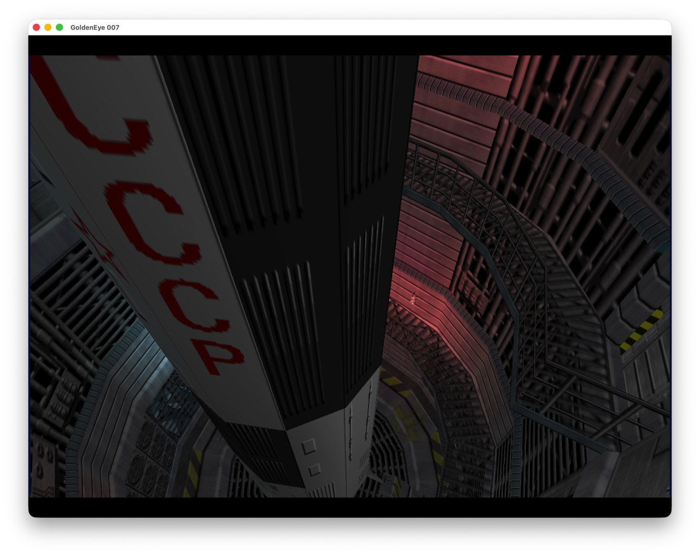
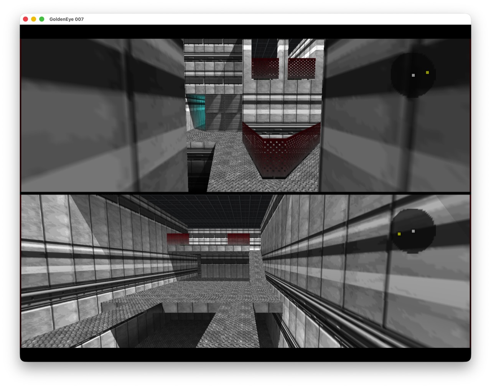
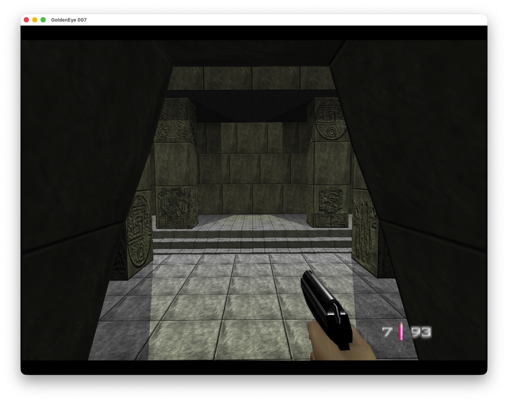
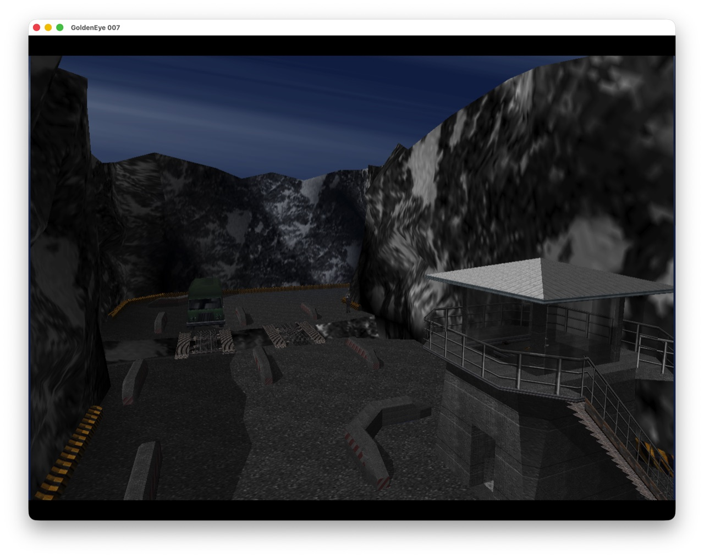
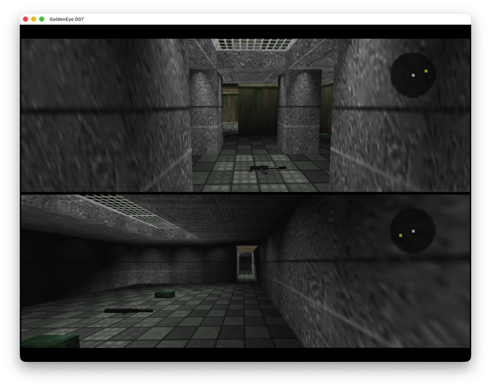

# Goldeneye-Native

A native port of GoldenEye 007. The game's C source comes from the
[`n64decomp/007`](https://github.com/n64decomp/007) decompilation and is compiled directly for
the host with clang; a platform layer supplies windowing, input, audio and a Fast3D display-list
renderer on top of SDL2 and OpenGL. There is no MIPS interpreter, no dynamic recompiler and no
static recompilation step — the binary is the game, built as ordinary C.



## What works

All 26 loadable stages boot, run through gameplay, render and exit cleanly. There are no known crashes,
hangs, or stages that fail to start or end properly. Eleven further stage ids have no data in the ROM at all —
nine were cut during development, and one level, Citadel, has a background file but no setup file, so it can
never load. 

Multiplayer works, including split screen, the radar and all 64 selectable characters. The pause
watch renders all five pages. Saves persist. The game renders at 60 fps with configurable
resolution and supersampling.

What has not been verified is a full playthrough: combat balance, AI behaviour over time,
objective completion, and finishing a level end to end. The port renders and reaches a playable
state everywhere. Whether it plays correctly from start to finish is untested, and the known issue
below on tick-coupled gameplay is a concrete reason to expect that it does not yet.

Today it builds and plays on **macOS 13 or later on Apple silicon (arm64)**. Windows and Linux are in pipeline asap; the game layer itself is not platform-specific, so the remaining work is confined to the platform layer and the build script, and is listed in [`docs/PORTING.md`](docs/PORTING.md). ZX Spectrum Emulator intentionally not wired up.

## What this is not

Not an emulator: no MIPS interpreter and no dynamic recompiler. Not static recompilation: no
generated C, no ELF input, no recompiler tooling. Not a fork of the Xbox 360 XBLA remaster. 

This project is not affiliated with, endorsed by, or connected to Nintendo, Rare, MGM, Danjaq or
EON Productions.

## Bring your own ROM

**No ROM, no extracted assets and no game data are distributed with this repository, and none
ever will be.** You need your own legal copy of the NTSC (US) cartridge, dumped to a file. This is
not a licensing formality that a mirror quietly works around: every texture, model, animation,
sound bank and level layout is read out of your dump at build time and emitted as C. Roughly 746
of the translation units this build compiles are generated that way.

| Property | Value |
|---|---|
| Size | 12,582,912 bytes exactly |
| Byte order | Big-endian `z64` |
| Header magic | `80371240` |
| Internal name | `GOLDENEYE` |
| SHA-1 | `abe01e4aeb033b6c0836819f549c791b26cfde83` |

That SHA-1 is the value in `ge007.u.sha1` in the decompilation, so a dump with that hash is
byte-identical to what a correct US build must produce. If your dump has a `.n64` or `.v64`
extension, or a header of `37804012`, it is byte-swapped and must be converted to native
big-endian first.

The build reads the ROM through the decompilation's own extraction scripts, which expect it at the
root of the decomp checkout under a fixed name, `vendor/ge-decomp/baserom.u.z64`. The convention
used here is to keep dumps in `roms/` at the repository root and symlink one into place.
`.gitignore` blocks `roms/`, every `*.z64` / `*.n64` / `*.v64` / `*.elf`, all `getv/build-*`
directories (they contain object files compiled from extracted ROM data), `*.bmp` frame captures,
and `vendor/` and `deps/` themselves. Do not defeat those rules.

Two further things are absent from a fresh clone for related reasons. Fifteen third-party
port-layer files — the Fast3D renderer and the audio mixer, inherited from sm64ex — are fetched
from a pinned upstream commit by `tools/fetch-thirdparty.sh`, because their redistribution terms
are unresolved. The SDL2 2.30.9 source tree is supplied by you in `deps/SDL2-2.30.9`, and built
from source, because a Homebrew running under Rosetta produces an x86_64 SDL2 that cannot link
into an arm64 binary.

## Quick start

Prerequisites: macOS 13+ on Apple silicon, Xcode Command Line Tools, CMake, Python 3, and the
stock `/bin/bash` 3.2. Nothing newer is needed.

```bash
tools/fetch-thirdparty.sh fetch                                       # the fifteen files
git clone https://github.com/n64decomp/007 vendor/ge-decomp           # the game's C source
# then: apply getv/patches/0001-source.patch, place your ROM, generate the asset sources
# from it, and apply getv/patches/0002-assets.patch — docs/SETUP.md sections 2.4 and 3
cd getv && ./build_mac.sh sdl && ./build_mac.sh all && ./build_mac.sh run
```

**[`docs/SETUP.md`](docs/SETUP.md) is the step-by-step guide** — every prerequisite, every command,
the expected output of each one, and a troubleshooting section. Read it if you have not built this
before. The asset-generation step is the one that cannot be shortened: it is a sequence of
extraction and code-generation passes, not the one line above, and skipping any of them produces
a tree that fails to compile or silently misbehaves.

## Screenshots












## Build

`getv/build_mac.sh` takes one of `sdl`, `lib`, `port`, `app`, `all`, `run` or `env`.

- `sdl` builds SDL2 2.30.9 for arm64 into `~/.n64tvos/sdl2-mac` — deliberately outside the
  repository, because the repository path contains a space and that has broken header search
  paths here before. Once per machine.
- `lib` compiles the game, assets, audio and platform layer into `build-mac/obj`.
- `port` recompiles only `getv/port/**` and the two harness objects. About 23 s.
- `app` archives the objects into `build-mac/libge.a` and links `build-mac/goldeneye`.
- `all` is `lib` followed by `app`.
- `run` launches the linked binary, forwarding any arguments.
- `env` prints the resolved SDK, SDL prefix, target triple and output paths.

There is no incremental check — every `lib` is a full recompile of all 992 objects. Measured at
21 s wall for `all` on an Apple M1 with warm caches. Compilation is parallel; `GETV_JOBS` caps the
job count and defaults to 6.

Expected output from `./build_mac.sh all`:

```
  mac FAILED: src/tlb_manage.c
mac game: 167 built, 1 failed
mac assets: 746 built, 0 failed
mac audio: 40 built, 0 failed
mac port layer: 23 built, 0 failed
```

**The one failure is expected.** `src/tlb_manage.c` programs the N64's MIPS R4300 translation
lookaside buffer. There is no TLB to program here and nothing links against it, so it is left to
fail rather than being papered over. Seven further N64-hardware and SGI-dev-host files
(`usb.c`, `rmon.c`, `sched.c`, `ramrom.c`, `init.c`, `indy_comms.c`, `indy_commands.c`) are
excluded by name in the build script for the same reason. Any second name in a `mac FAILED:` line
is a real problem.

## Run

```bash
./build-mac/goldeneye
```

Keyboard is bound to controller port 0 by default: WASD to move, arrow keys to look, Space or
Left Ctrl to fire, E or Return to use, Q to aim, Z and X for the shoulder buttons, Tab to pause,
IJKL for the d-pad, F11 for fullscreen. A connected gamepad works alongside it — whichever input
is held wins, so plugging in a pad never degrades the keyboard and vice versa.

## Configuration

On first run, with no configuration file present anywhere, the game writes a commented template to
`~/Library/Application Support/GoldenEye/goldeneye.cfg` and immediately reads it back. This is not
a convenience: several of the port's tuned defaults — `invert_look` being the case in point — only
exist in that template, and a default that lives in a file nobody has generated is not a default.
Edit that file to taste, or regenerate it with `--write-config`.

Save data is separate, and lands in
`~/Library/Application Support/Goldeneye-Native/eeprom.bin`. It is 512 bytes: GoldenEye saves to
the cartridge's serial EEPROM, and writes are atomic.

A few keys worth knowing:

| Key | Values | Default |
|---|---|---|
| `resolution` | `WIDTHxHEIGHT`, `fullscreen`, `native` | `1280x960` |
| `supersample` | `1`, `2` | `1` |
| `filtering` | `point`, `bilinear`, `three-point` | `three-point` |
| `framerate` | `30`, `50`, `60`, `off` | `60` |
| `controls` | any of Rare's eight styles, by number or name | `2.2 galore` |
| `roster` | `8`, `64` | `8` |

Every setting is documented in [`docs/CONFIGURATION.md`](docs/CONFIGURATION.md). The named cheat
system is in [`docs/CHEATS.md`](docs/CHEATS.md). If you want to change the game rather than play
it, start at [`docs/MODDING.md`](docs/MODDING.md); the roughly 250 `GETV_*` environment gates are
the practical extension surface, and each defaults to preserving stock behaviour.

## Layout

```
getv/port/        platform layer: renderer, audio, input, config, saves, paths
getv/patches/     this port's changes to the decompilation and to the fetched sources
getv/build_mac.sh the macOS build
getv/tools/       measurement harnesses
tools/            asset generation, and the third-party fetcher
docs/             documentation
vendor/           decompilation and fetched upstream sources   (untracked)
deps/             SDL2 source                                  (untracked)
roms/             your ROM                                     (untracked)
```

Everything not listed as tracked is fetched, cloned, or derived from your ROM.

## Documentation

| | |
|---|---|
| [`docs/SETUP.md`](docs/SETUP.md) | The build guide. Start here. |
| [`CONTRIBUTING.md`](CONTRIBUTING.md) | The four things specific to this project: no game data, the patch workflow, measuring, provenance. |
| [`docs/CONFIGURATION.md`](docs/CONFIGURATION.md) | Every configuration key, and the reserved ones that are inert. |
| [`docs/CHEATS.md`](docs/CHEATS.md) | The game's own cheat system, exposed by name. |
| [`docs/MODDING.md`](docs/MODDING.md) | How the tree is arranged and where the seams are. |
| [`docs/ROADMAP.md`](docs/ROADMAP.md) | Current state, known issues, planned work. |
| [`docs/PORTING.md`](docs/PORTING.md) | What Windows and Linux would take, per file. |
| [`docs/THIRD_PARTY.md`](docs/THIRD_PARTY.md) | The fifteen fetched files: what, whence, and why not vendored. |
| [`docs/LICENSING.md`](docs/LICENSING.md) | Where every part came from and which terms are settled. |
| [`docs/ASSET_LOADING.md`](docs/ASSET_LOADING.md) | Level asset loading: map, holes, plan. |
| [`docs/PERFECT_DARK.md`](docs/PERFECT_DARK.md) | What the MIT-licensed Perfect Dark port offers this one. |
| [`getv/port/PROVENANCE.md`](getv/port/PROVENANCE.md) | Per-directory origin of the platform layer. |

## Known issues

- **Gameplay is coupled to the render rate.** GoldenEye scales some systems by elapsed video
  frames and runs the rest once per game update, and a game update is one rendered frame. Only 13
  of the 135 translation units under `src/game` reference `g_GlobalTimerDelta`: recoil, sway,
  breathing, camera. Everything else is per-frame. Enemy automatic fire is the clearest case --
  `chraction.c:6694` increments `firecount[hand]` once per tick and fires on
  `firecount % automaticFiringRate == 0`, so the cadence is a frame count, not a duration.
  On hardware those systems ran at the N64's real 20 to 30 fps. Rendering at a locked 60 runs them
  roughly twice as fast, which shows up as turrets and guards firing too quickly, ammunition
  draining too quickly, and AI state machines stepping faster than they were tuned for. Animation
  looks correct throughout, because animation is in the 13.
  There is a partial mitigation as of now: `framerate=30` also sets `GETV_TICKFIELDS=2`, so each
  update reports two elapsed fields. Game time stays real -- thirty updates a second times two
  fields is sixty fields a second, leaving animation and the mission clock untouched -- while the
  frame-counted systems drop to 30 Hz, close to the cadence the game was tuned for. That setting
  previously capped the renderer without the second half and ran the game at half speed, which was
  a defect rather than the inherent property it was documented as.
  It is a trade, not a fix: 60 renders smoothly and runs gameplay fast, 30 runs gameplay correctly
  and renders less smoothly. Having both at once needs a fixed-rate simulation tick with rendering
  interpolated above it, which is architecture rather than a setting, and is the next substantial
  thing this port needs.

- **Depot ground colour.** The ground renders saturated blue where the original is near-neutral
  dark asphalt: rgb(27,19,85) against rgb(10,10,10), measured against a reference capture.
  The cause is in `ge_resolve_unit_tile`. When the render tile is resolved and the TMEM map is
  not in use, the port points it at the most recently loaded block unconditionally:
  `rdp.loaded_texture[0].addr = rdp.block_addr`. That is right whenever one block is live, which
  is nearly always. Depot's ground draws with two: a 256-byte block at TMEM 0 with its own TLUT,
  then a 2808-byte block at TMEM 32. The render tile sits at TMEM word 19, inside the first, and
  the port reads it out of the second. The palette is correct throughout -- its offset from the
  *first* block is 256, exactly that block's size, which is the same invariant every other decode
  in the game satisfies -- so the result is a valid palette applied to the wrong bytes, which is
  why the probe reports `distinct_idx == distinct_col` while the colours are nonsense.
  It is measurable: `GETV_TMEMMAP=1` binds each tile to the block its TMEM actually falls in and
  counts the corrections. Depot makes 27,416 of them in a four-hundred-frame run. Dam, Cradle and
  Silo make none, which is why this is the only level where it shows.
  Enabling that gate is not yet a fix. It restores the binding -- the decode narrows from 16x175
  to 16x6, matching the tile's real extent, and the palette offset lands on the invariant -- but
  the ground comes out cyan rather than neutral, so a second factor remains, most likely the
  format: the game declares this texture `gbifmt=4` (intensity) while the render tile descriptor
  says CI8.
- **Frigate sky.** Flat dark navy rather than blue with cirrus. The cloud display list runs and
  emits more commands than any other stage's, so the path is active.
- **Missing gold crest on the multiplayer character select.** The same crest renders correctly on
  the file select screen, so the asset and its decode path are sound.
- **Select File background.** Renders flat black; the original has a faint circular watermark
  behind the folders.
- **Three unresolved colourings** — Surface 2 fog density, Cradle sky gradient, Facility vent
  colour. No reference captures exist for them, so they are neither confirmed correct nor
  confirmed defects.
- **No framerate above 60.** The game integrates fire rates, physics, animation and the mission
  clock once per rendered frame, so raising the render rate raises the game speed with it. Values
  above 60 are rejected by the configuration layer for that reason.
- **Multiplayer edge cases.** Score caps are not enforced on the headless path, and `num_shots`
  disagrees with the fire path.
- **Keyboard and mouse.** Mouse look is not supported.

[`docs/ROADMAP.md`](docs/ROADMAP.md) carries the full list and the planned work.

## Provenance and licensing

[`LICENSE`](LICENSE) is MIT, and it covers the original work here: the platform layer under
`getv/port/` excluding the fetched third-party sources, the build scripts, `tools/`, and the
documentation. It does not and cannot cover anything else. [`NOTICE`](NOTICE) states the scope
precisely.

Read [`getv/port/PROVENANCE.md`](getv/port/PROVENANCE.md) before redistributing anything. It
records, per directory, where the platform layer's code came from — in particular that the license
status of `getv/port/fast3d/`, which descends from sm64ex's copy of
`Emill/n64-fast3d-engine`, is **unresolved**. The notice sm64ex ships is the pre-2021 form, whose
second condition bans binary redistribution outright. Do not assume it is MIT.

The decompilation itself has no license file, and its libultra sources carry SGI proprietary
headers. That is upstream's situation, but it is a fact about the base this port is built on.

The ROM, extracted assets, and anything derived from them are never distributable under any
license.

## Credits

Built by Evan King ([@SegfaultEvan](https://github.com/SegfaultEvan)).

The game's C source is the work of the [`n64decomp/007`](https://github.com/n64decomp/007)
decompilation project. The renderer and audio mixer descend from
[sm64ex](https://github.com/sm64pc/sm64ex), which in turn derives its Fast3D implementation from
[Emill/n64-fast3d-engine](https://github.com/Emill/n64-fast3d-engine); neither is redistributed
here. See [`docs/THIRD_PARTY.md`](docs/THIRD_PARTY.md) and [`NOTICE`](NOTICE).

GoldenEye 007 was made by Rare.
